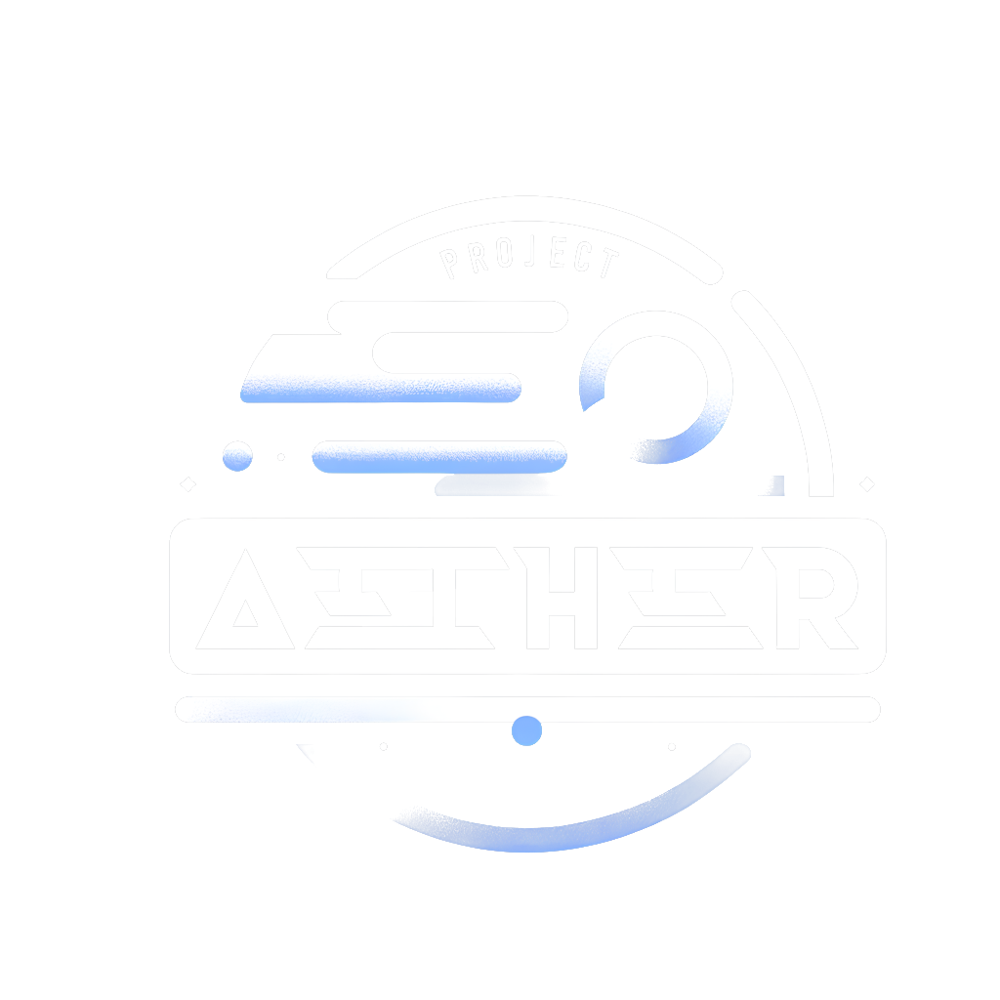

<h1 align="center">A performant, cross-platform game engine

## What is Project Aether?

Project Aether is a game engine written in [Zig](https://ziglang.org/)⚡

It is platform agnostic; there should be no difference running between Windows, Linux, and consoles like the PSP or the 3DS.

All user code is a library that gets linked into the engine. The user simply has a state machine, event system, and ECS system.

